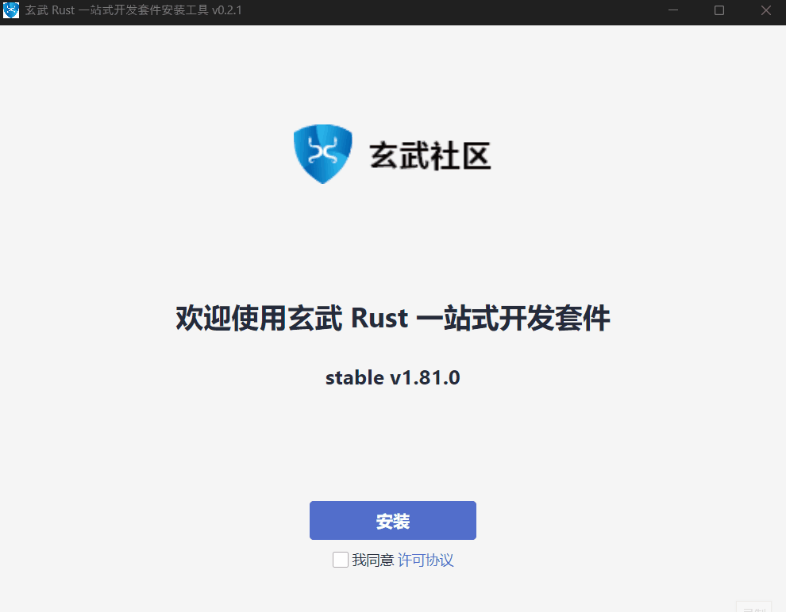
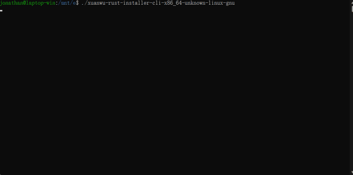

# R.I.M (Rust Installation Manager)

[]([https://j-zhengli.github.io/rim](https://xuanwu.beta.atomgit.com/guide/))
[](https://j-zhengli.github.io/rim)

An interactive program to install & manage Rust toolchain and third-party tools, supports graphical user interface (**GUI**) and a basic commandline interface (**CLI**).

## Demo

### GUI



### CLI



## How does it work?

### Fundamental

This program takes one configuration file [`toolset-manifest`](./resources/toolset_manifest.toml), loads a list of tools from it,
then takes advantage of [`rustup`](https://github.com/rust-lang/rustup) to install Rust toolchain, and uses various method to install different tools (*supporting `vscode`, `MSVC buildtools`, `MinGW` etc, conditions and limitations applied, the details are in the [Support](#support) section).

After installation, users will have a `toolkit`, which is a combination of Rust toolchain and (**maybe**) a collection of tools if user choose to install it.
The `toolkit` can be upgraded/downgraded as well. Which requires another configuration file,
called [`distribution-manifest`](./resources/mock/dist/distribution-manifest.toml), this is typically stored in a server, telling the program what `toolkit` is available to be installed.

### Installer and Manager

The functions of this program are splitted into two parts: `installer` and `manager`, similar to `rustup`'s `rustup-init` and `rustup`.

- `installer` does the setup work, which initializes the local environment, that includes:
  - creating the installation root
  - setup `CARGO_HOME`, `RUSTUP_HOME`, `RUSTUP_DIST_SERVER`, `RUSTUP_UPDATE_ROOT` environment variables automatically. (Note if you already have these configured, those might get overrided).</br>
After env setup, it will guide you through installing Rust `toolkit`.
- `manager`, well... it manages stuffs, such as `updating` and `uninstalling` toolkit. (`components managing` is on the way)

> Unlike `rustup`, this program can be used to manage additional set of tools instead of the Rust toolchain.
> Additionally, this program installs `rustup` by default, so you can continue using `rustup` with no problems.

## Build

### Prerequisite

1. Install [Rust](https://rustup.rs/)

    > If you only need the CLI binary, you don't need any dependencies other than `Rust`, so you can skip ahead.
    > But If you need the GUI binary, you'll have to install additional packages such as `NodeJS`.

2. Install [`NodeJs`](https://nodejs.org/en/download)
3. Install [`pnpm`](https://pnpm.io/installation), you can install by using `npm` after installing `NodeJS` using the following command:

    ```bash
    npm install -g pnpm@latest
    ```
4. (Linux Only) Install additional dev packages using:
    ```bash
    bash ./ci/scripts/install-tauri-deps.sh
    ```

### Debug

- Debug `installer` mode:
  - Commandline interface
  ```bash
  cargo dev run --cli --installer
  ```
  - Graphical interface
  ```bash
  pnpm dev run --installer
  ```
- Debug `manager` mode:
  > Running `manager` is not as straight forward as running in `Installer` mode.
  Because `manager` binary need to be put alongside with some configuration files or such,
  otherwise it will panic. Luckily there's a helper command to help you creating a mocked environment,
  so you can test `manager`'s functionalities easier.

  ```bash
  cargo dev run --manager
  ```

### Release

1. Before creating releases, you should know which edition to build for,
the release editions can be found in [`toolkit` configuration file](./resources/toolkits.toml), and the default edition is `Basic` for testing purpose.
If you need to release for other editions (such as `community`), specify it with `EDITION` env arg just like:

    ```bash
    export EDITION='community'
    ```

2. If you need the offline package releases, you also need to vendor the packages
   used for offline installation, it can be done using:
   ```bash
   cargo dev vendor --download-only
   ```

3. Then you can finally run the command to create released package(s) using specific command in the below table, and the result will be stored under `dist/` directory.

    |          | Net Installer | Net Installer & Offline Package |
    | -------- | ------------- | ------------------------------- |
    | **CLI**  | `cargo dev dist -b --cli` | `cargo dev dist --cli` |
    | **GUI**  | `cargo dev dist -b --gui` | `cargo dev dist --gui` |
    | **Both** | `cargo dev dist -b` | `cargo dev dist` |

## Usage

> Only `CLI` mode is listed, for `GUI` usages, checkout [this page](https://xuanwu.beta.atomgit.com/guide/) for details.
>
> Currently, GUI mode only supports **Chinese**, the English support and its usage doc will be available soon.

### Installer mode (CLI)

```console
Usage: rim-cli [OPTIONS]

Options:
  -l, --lang <LANG>             Specify another language to display [possible values: cn, en]
      --prefix <PATH>           Set another path to install Rust
      --manifest <PATH or URL>  Specify a path or url of manifest file that contains package source and various configurations
  -h, --help                    Print help
  -V, --version                 Print version
```

#### Examples

1. Set a default directory for installation:

    ```bash
    ./rim-cli --prefix path/to/dir
    ```

2. Install by loading a custom manifest (template: [`toolset_manifest.toml`](./resources/toolset_manifest.toml)):

    ```bash
    ./rim-cli --manifest path/to/your/toolset-manifest.toml
    ```

### Manager mode (CLI)

> Manager mode will run after an installation record was detected, and it can also be overridden by
> having a `MODE` environment variable set to `manager` before running the program, such as running `export MODE='manager'` in Unix systems.

```console
Usage: MODE='manager' rim-cli.exe [OPTIONS] [COMMAND]

Commands:
  update     Update toolkit and/or this installation manager
  uninstall  Uninstall individual components or everything
  try-it     A subcommand to create a new Rust project template and let you start coding with it
  help       Print this message or the help of the given subcommand(s)

Options:
  -l, --lang <LANG>  Specify another language to display [possible values: cn, en]
  -h, --help         Print help
  -V, --version      Print version
```

#### Examples

1. uninstall all:

```bash
./manager uninstall
```

2. update self and toolkit:

```bash
./manager update
```

3. update toolkit only:

```bash
./manager update --toolkit-only
```

1. Export a pre-configured example project:

```bash
./manager try-it -p /path/to/create/project
```

## Support

This program support installing packages in various format, that you may put into a [`toolset-manifest`](./resources/toolset_manifest.toml) and pass an `--manifest path/to/your/` when executing the CLI app to have an option to install them.

Currently, the following package formats are supported:

1. Binaries - (with extension `.exe` on Windows, and no extension on Linux)
2. VS-Code plugins - (`.vsix` files)
3. *Compressed files - (with extension `.gz`, `.xz`, `.7z`, `.zip`)

For compressed files, the program will first try to decompress it into a temporary path, then identify the structures within, which could boil down to this two kinds:

1. Directory with `bin/` folder
2. Plain directory

Both will be placed under `<InstallationRoot>/tools` folder, but if the directory has a `bin/` folder, its path will be added to user's `PATH` variable additionally.

## Known problems

1. There's a bug related to the WebKitGTK on some linux distro, which causing the GUI program showing blank upon starting.
  This issue can be bypassed after setting the environment variable `WEBKIT_DISABLE_COMPOSITING_MODE` to `1`:

    ```bash
    export WEBKIT_DISABLE_COMPOSITING_MODE=1
    ```
